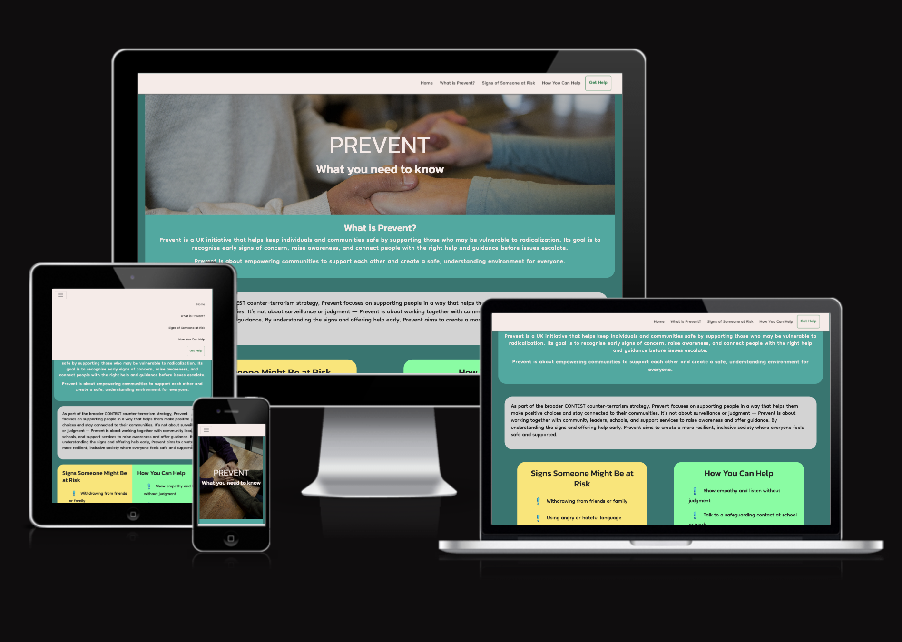
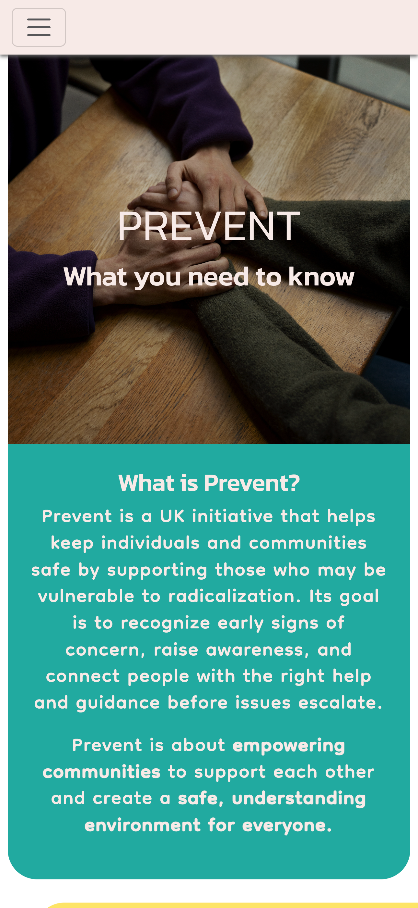
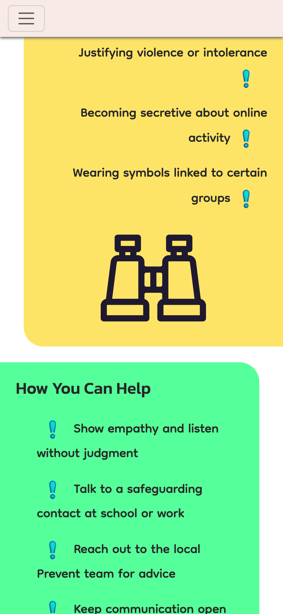
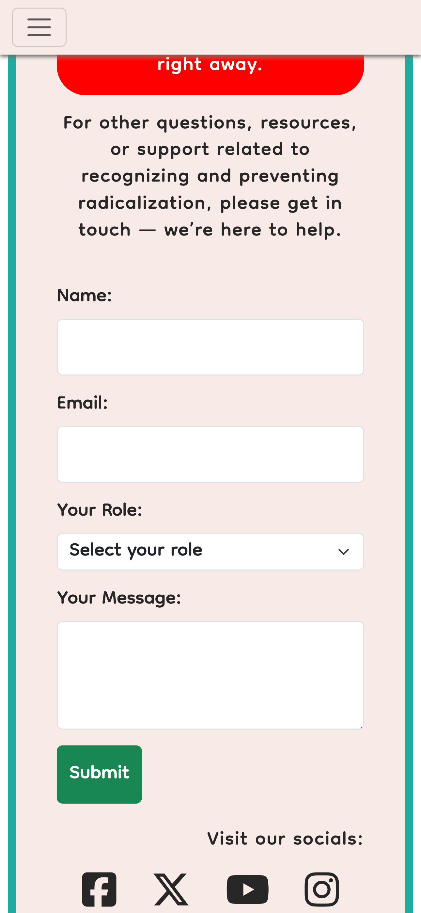
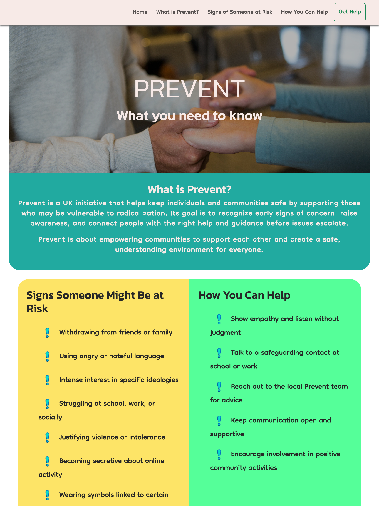
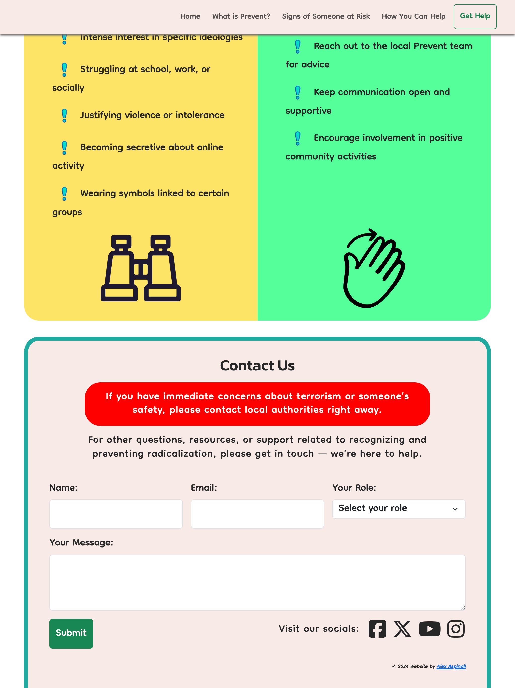
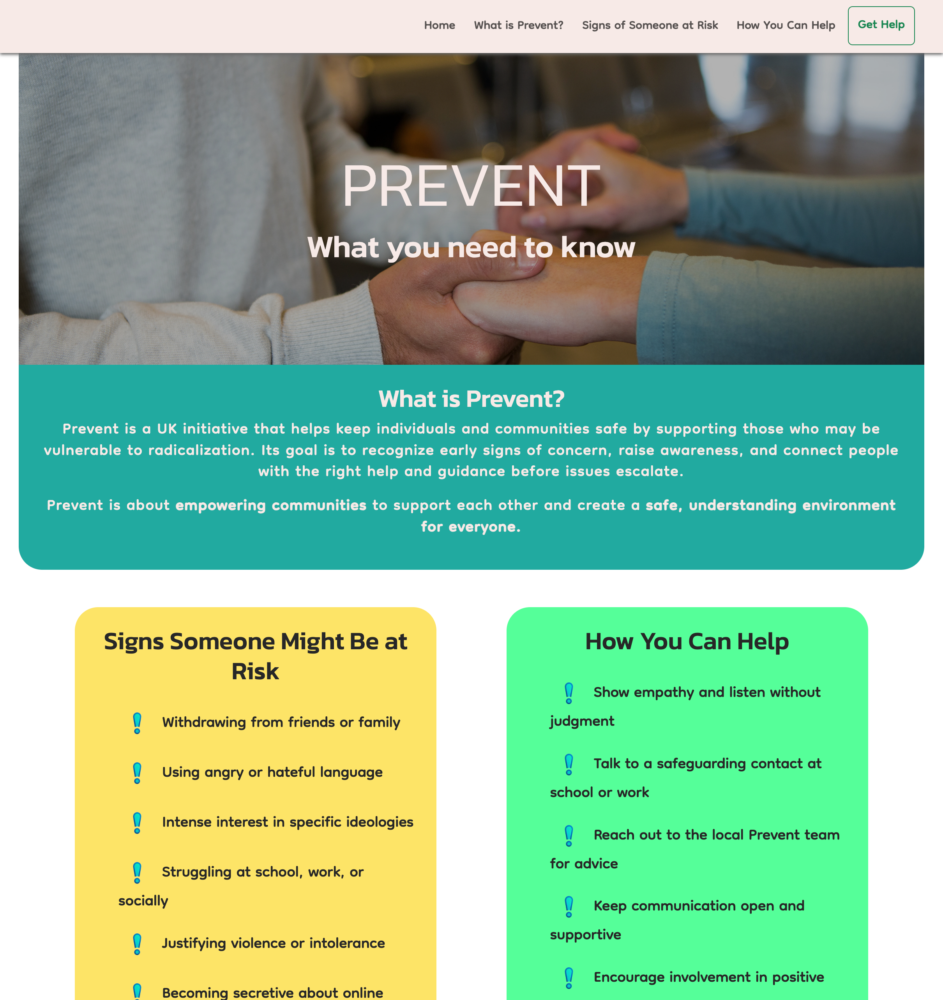
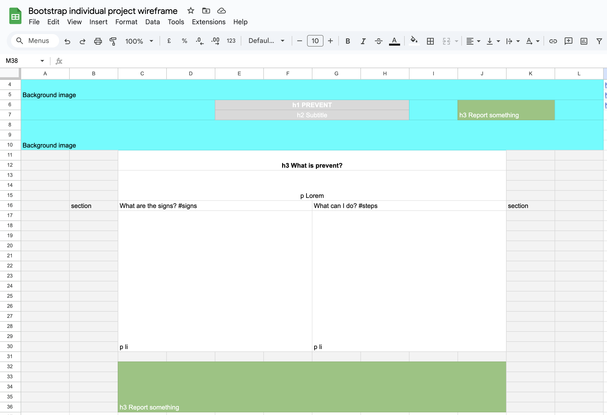
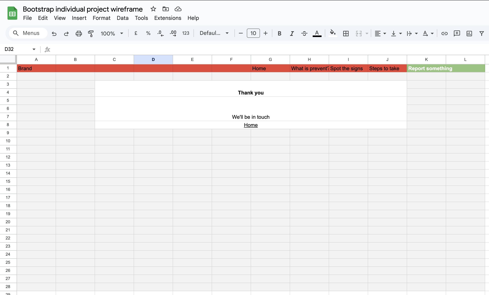

# Individual Formative Assignment - "Prevent"

#### Live site link:
https://alexaspinalldev.github.io/prevent/

## Introduction
"Prevent - What you need to know" is website created in HTML5, CSS3, Bootstrap 5.3 and Javascript designed to outline the basic facts of the UK's Prevent program. Prevent is a an initiative intended to spot and support people who may be vulnerable to radicalisation. Its goal is to recognise early signs of concern, raise awareness, and connect people with the right help and guidance before issues escalate.

 

## Site Responsivity examples
#### Mobile
  

#### Tablet
 

#### Large laptop (>1200px)

## Contents
- UX
- - Stories
- - Wireframes
- Design
- - Fonts
- - Colours
- - Images, Favicons
- - Content
- Features
- - Highly responsive layout (photos)
- Future scope (issues and blocky nature, white space)
- Technologies used
- Deployment
- Testing
- Credits

## UX
### Scoping
In planning I started with establishing my user goals and personas:

**External User’s Goal:** The user wants a basic introduction to the Prevent strategy, including how to recognize signs of radicalization and how to report concerns presented in a simple, easy-to-navigate format.

**Site Owner’s Goal:** The site owner’s goal is to create an informative webpage that introduces the Prevent strategy. The content should be well-organised and easy to digest, with a focus on simplicity and clarity.

**User persona:** Members of the public looking for information, or wanting to report something they're concerned about.

### User stories
Below are the User Stories I used during the project. Some are general initial requirements and some are requirements that developed at the project went on.

### Wireframes
I used Google Sheets as my wireframing tool as I'm most comfortable with that platform and I coudl easily set up Bootstraps 12-column width arrangement.

 

## Design
### Fonts
My primary font for all body text is Dongle - this was my second choice after my first font was deemed too staid. This font required modicum of manipulation as it came out very small, and increasing the size also added unwanted line height.

My secondary font for all headings is Kanit chosen for it's nice medium formality.

### Colours
I defien the following variables at the beginning of the project:
    --white: #F7EBE8;
    --black: #272727;
    --teal: #22AAA1;
    --red: #FDE467;
    --mint: #55FF99;

I used slightly off-shades of white and black in an experiment in breaking away from standard colours.

You'll see that my "red" variable ended up being a shade of yellow - this is a lesson for me on naming variables!

### Images
Images were sourced from [Freepik](freepik.com) and [SVG Repo](svgrepo.com).

My research into Prevent encouraged me to go down a more pastoral route, so I used images featuring people holding hands in connection to underline than Prevent is about care and community.

### Favicons
My favicon is from an image generated by DALLE via ChatGPT, manipulated using [RealFaviconGenerator](realfavicongenerator.net). I was also able to use this as a bulletpoint.

### Content
All text content was generated by ChatGPT, with revisions designed to make the tone friendier and more informational.

## Features
### Highly responsive layout
The website features what I consider to be a highly responsive layout with three different configurations depending on screen size. In particular, the mobile layout is designed to encourage downwards- scrolling using the snaking whitespace left by the assymetric paragraphs. Upon scaling up, the right-justified paragraph resolves to the left.

### Header image
Smaller screens also feature a header image better suited to the narrower form factor than the image used on wider screens.

Quite elegantly, the header image is tinted using a CSS box-shadow inset and sized to cover the image entirely.

## Future scope
Further tweaks for this website will be to lessen the "primary" nature of the colours used in favour of a more closely grouped pallate.

Due to the timed element of this project I would like to be able to go back and improve the semantic layout of the site.

An idea I had that I did not have time to implement was to have the #maincontent section appear to sit behind the header, in a nested arrangement.

The overall tone of the site is a little mixed currently.

Finally, I am not satisfied with the amount of blank space shown on CL screens - this is mainly a limitation of Bootstrap's columns which cannot be 50% width with this design.

## Technologies used
- HTML5
- CSS3
- Javascript
- Bootstrap 5.3
- Font Awesome
- Google Fonts

## Deployment
The site is deployed to GitHub pages:
- In the GitHub repository, navigate to the Settings
- From the source section drop-down menu, select the Master Branch
- Once the master branch has been selected, the page will be automatically refreshed with a detailed ribbon display to indicate the successful deployment.

The live link can be found here: https://alexaspinalldev.github.io/prevent

## Testing
#### Manual testing
Testing on all screensizes revealed that there the sheer amount of whitespace and lack of content (seen in above screenshots) left the site looking sparse, and like a whiteboard. This was resolved in the closing stages of the project with a more muted background colour and additional content.

Testing showed that all breakpoints and media queries function as expected, save for the warning banner in the footer which required some finessing.

I found that the contact form was erroring due to it's method="post" attribute so I removed that for the sake of demonstration.

#### HTML validation

#### CSS validation

#### Lighthouse testing

#### Unfixed bugs
I found in manual testing that, on mobile the ! bulletpoints sit on the second line, of their content when wrapped. This is due to them being placed as an ::after psuedo-class.

The \<select> element in the Contact form is a different height to the other fields - this is due to how I was required to scaled up my chosen font significantly.

## Credits
Images were sourced from [Freepik](freepik.com) and [SVG Repo](svgrepo.com).

Copy is generated by [ChatGPT](chat.openai.com/).

Favicon is from an image generated by DALL-E via ChatGPT, manipulated using [RealFaviconGenerator](realfavicongenerator.net).

I established and refined my colour pallate using [Coolors](coolors.co).